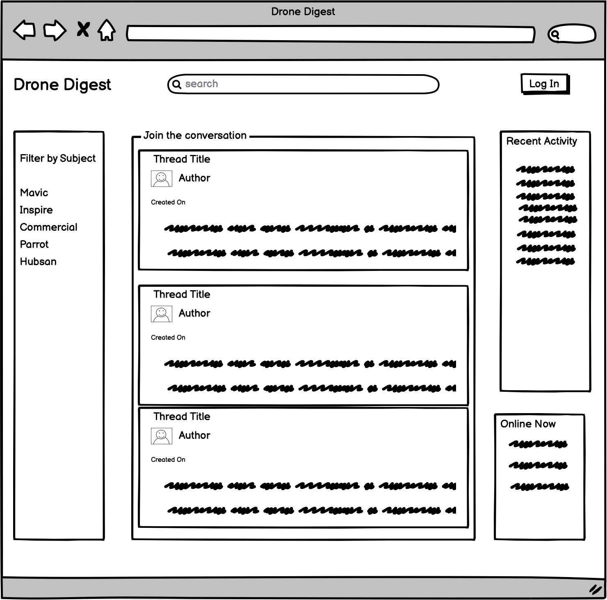
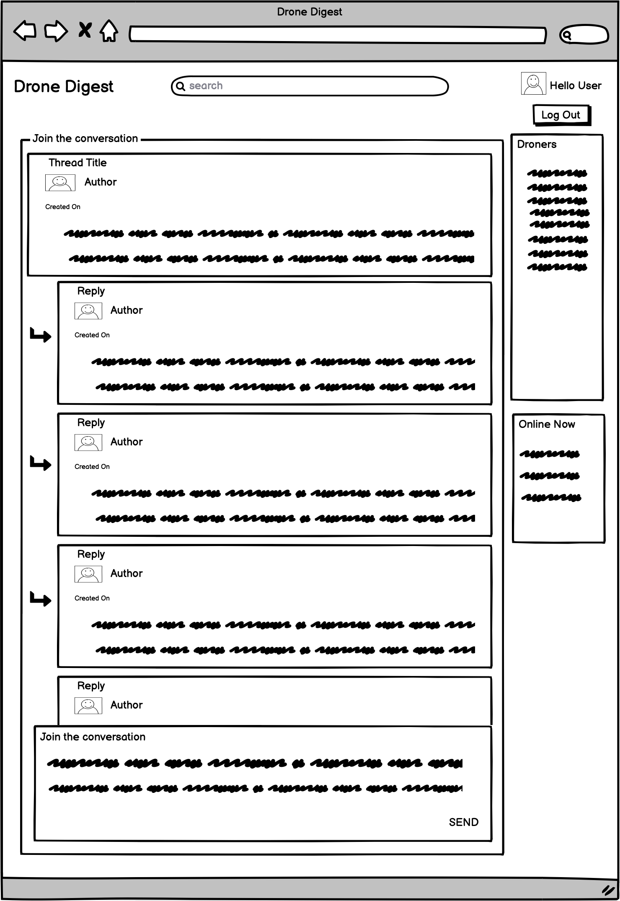
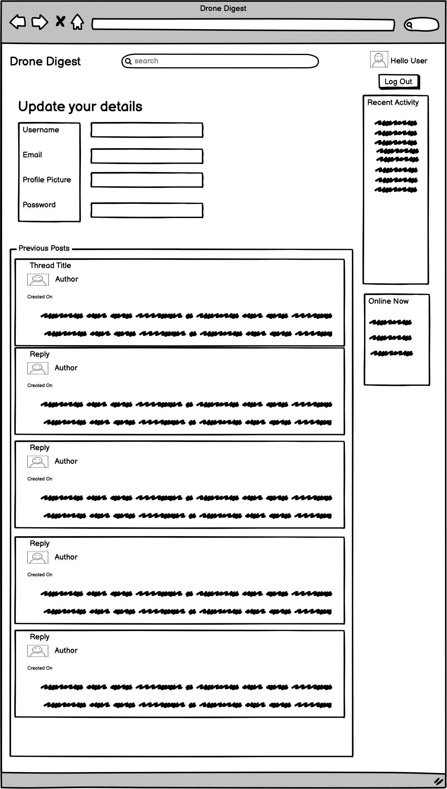

# Drone Digest

Drone Digest is a public chat forum style website aimed at both individuals and commercial enterprises with interests in Unmanned Aerial Vehicles (UAVs), more commonly known as drones.

The pace of change in the UAV market is extraordinary, with new regulations and equipment entering the market numerous times a year. The UAV market is predicted to be worth $63.6 billion by 2025 [*Source*S](https://www.businessinsider.com/drone-industry-analysis-market-trends-growth-forecasts?r=US&IR=T) and will only get larger given technological advances in the use of drones for agriculture, construction and law enforcement to name but a few.

Until now, current offerings for those interested in having a discussion about UAVs are spread far and wide, but only catering to a small niche of the market, for example particular types of aircraft, or split by commercial and hobbyist lines.

The Drone Digest aims to provide a 'one stop shop' for all of these strands, bringing together experience from across the sector so seasoned and budding UAV pilots alike can share experiences, expertise and keep up to date with the latest changes in this ever evolving and growing sector.

You can view a live version of the [website](http://drone-digest.herokuapp.com/) 

## Table of Contents

1. [Site Design Considerations](#site-design-considerations)
    * [User Stories](#user-stories)
        * [EPIC 1 - User Accounts](#epic-1---user-accounts)
        * [EPIC 2 - Message Boards](#epic-2---message-boards) 
        * [EPIC 3 - Post Interactions](#epic-3---post-interactions)
    * [Wireframes](#wireframes)
    * [Project Management](#project-management)
2. [Data Models](#data-models)
3. [Features](#features)
    * [Initial Deployment Features](#initial-deployment-features)
    * [Future Features](#future-features)    
4. [Technologies Used](#technologies-used)
5. [Testing](#testing)
6. [Deployment](#deployment)
7. [Credits](#credits)

## Site Design Considerations

### User Stories

#### EPIC 1 - User accounts

1. As a User, I want to create an account using my email address so that I can create threads and comment on existing posts.

2. As a User, I want to create an account using my social media log in so that I can create threads and comment on existing posts.

3. As a User, I want to be able to view posts without logging in so that I can quickly catch up on conversation I have been involved in.

4. As a User, I want to be able to reset my password  so that I can still access my account if I forget it.

5. As a User, I want to be able to create a basic profile including a profile picture so that I can tell other users a little about myself.

6. As a User, I want to be able to see a history of posts I have made in my profile so that I can easily reference old conversations.

7. As a User, I want to be abe to see who is currently online so that I can interact with friends made on the platform in real time.

8. As a User, I want to be able to message other users so that I can interact privately with individuals.

9. As a User, I want to be able to report accounts so that I can highlight behaviour that goes against the forum rules.

10. As a Site Admin, I want to be able to create and assign moderators so that I can spread the workload of approving comments.

 

[Back to top](#table-of-contents)

 

#### EPIC 2 - Message boards

1. As a User, I want to be able to view a list of threads so that I select one to read.

2. As a User, I want to be able to filter threads by topic so that I select a topic that interests me.

3. As a User, I want to see a count of activity on a thread so that I can see the number of replies and views on a thread.

4. As a User, I want to be able to expand a thread so that I can view all of the posts made related to it.

5. As a User, I want to be able to see a list of who has participated in a thread so that I can easily see people I have interacted with before and new users.

6. As a User, I want to be able to create a new thread from the homepage so that I don’t have to go into a topic to create one.

7. As a User, I want to be able to search for topics and threads and users so that I easily find people or topics that interest me.

 

[Back to top](#table-of-contents)

 

#### EPIC 3 - Post interactions

1. As a User, I want to be able to create a new post so that I can start a conversation with other people.

2. As a User, I want to be able to comment on existing posts so that I can be involved in discussions.

3. As a User, I want to be able to edit existing posts that I have made so that I can amend any mistakes I may have made.

4. As a User, I want to be able to delete posts that I have made so that I manage my content.

5. As a User, I want to be able to see when a post was created or updated so that I can see how recent thread activity was.

6. As a User, I want to be able to add images to a post so that I so I can share examples or illustrate my point.

7. As a User, I want to be able to click on a post author so that I can find out further information about them or other posts that they have made.

8. As a User, I want to be able to 'like' a post so that I can interact with the content and see which are the most popular posts.

9. As a Site Admin, I want to be able to approve or disprove posts so that I can ensure all posts adhere to the site guidelines.

10. As a Site Admin, I want to be able to read, update and delete posts so that I can ensure all posts adhere to the site guidelines.

 

[Back to top](#table-of-contents)

 

### Wireframes

* Homepage

* Opened thread

* User profile page

 

[Back to top](#table-of-contents)

 

### Project Management

 

[Back to top](#table-of-contents)

 

## Data Models

 

[Back to top](#table-of-contents)

 

## Features

### Initial Deployment Features

 

[Back to top](#table-of-contents)

 

### Future Features

 

[Back to top](#table-of-contents)

 

## Technologies Used

 

[Back to top](#table-of-contents)

 

## Testing

 

[Back to top](#table-of-contents)

 

## Deployment

 

[Back to top](#table-of-contents)

 

## Credits

 

[Back to top](#table-of-contents)

 
